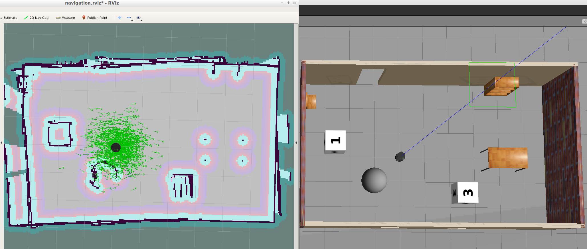
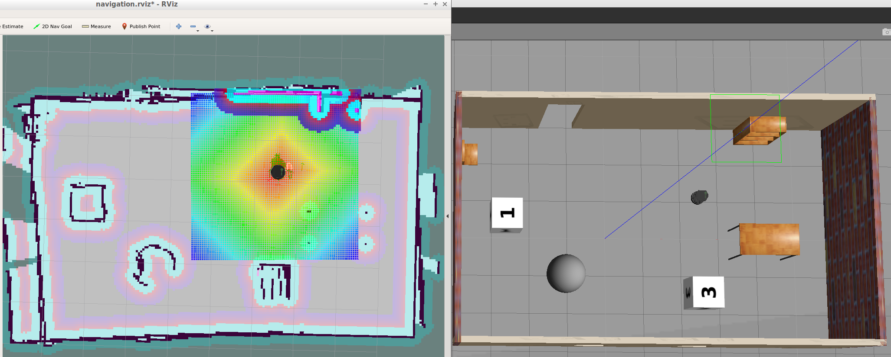

# RoboND-HomeServiceRobot
This is the repository for my Udacity Robotics Software Engineer Nanodegree Project - Home Service Robot. It contains a simulation world with Gazebo which includes a turtlebot robot. In this project I created a map from my simulated environment using SLAM, setup the navigation for my robot using AMCL and simulated virtual objects in RViz.

I implemented the following algorithm:
- a virtual object is displayed at the pickup zone
- the robot navigates to the pickup position
- the robot picks up the virtual object (object disappears, pause for 5 seconds)
- the robot travels to the drop off zone
- once the robot reaches the dropp off zone the virtual object is published at the drop off zone

## Output
The HomeServiceRobot ist launched by executing the home_service-script.
After launching the world the building, the obstacles, and the turtlebot are displayed inside a Gazebo World, RViz is launched as well as the ROS-nodes for navigating the robot and showing the virtual object. It should launch as follow:


## Directory Structure
```
    .RoboND-HomeServiceRobot                    # main folder 
    ├── add_markers                             # add_marker node 
    │   ├── src                                 # source folder for C++ scripts
    │   │   ├── add_markers.cpp
    │   ├── srv                                 # service folder for ROS services
    │   │   ├── PositionAction.srv
    │   ├── CMakeLists.txt                      # compiler instructions
    │   ├── package.xml                         # package info
    ├── images                                  # output images
    │   ├── homeServiceRobot.gif
    ├── map                                     # map files
    │   │   ├── nancys_map.gpm                  # contains a map file for the world
    │   │   ├── nancys_map.yaml                 # contains parameters for nancys_map.gpm
    │   │   ├── nancys_world.world
    ├── pick_objects                            # pick_objects C++ node
    │   ├── src                                 # source folder for C++ scripts
    │   │   ├── pick_objects.cpp
    │   ├── CMakeLists.txt                      # compiler instructions
    │   ├── package.xml                         # package info
    ├── rvizConfig                              # rviz configuration files
    │       ├── navigation.rviz
    ├── scripts                                 # shell script files
    │   ├── add_marker.sh
    │   ├── home_service.sh
    │   ├── launch.sh
    │   ├── pick_objects.sh
    │   ├── test_navigation.sh
    │   ├── test_slam.sh
    ├── slam_gmapping                           # package gmapping (gmapping_demo.launch file)
    │   ├── gmapping
    │   ├── ...
    ├── turtlebot                               # package turtlebot_teleop (keyboard_teleop.launch file)
    │   ├── turtlebot_teleop
    │   ├── ...
    ├── turtlebot_interactions                  # package turtlebot_rviz_launchers (view_navigation.launch file)
    │   ├── turtlebot_rviz_launchers
    │   ├── ...
    ├── turtlebot_simulator                     # package turtlebot_gazebo (turtlebot_world.launch file)
    │   ├── turtlebot_gazebo
    │   ├── ... 
    ├── .gitmodules                             # contains information about submodules
    └── README.md
```

## Steps to launch the simulation

### 1 Clone the repository in the catkin workspace i.e. /home/workspace/catkin_ws/src
```sh
$ cd /home/workspace/catkin_ws/src
$ git clone https://github.com/nancyreschka/RoboND-HomeServiceRobot.git
```

### 2 Initialize submodules
```sh
$ cd RoboND-HomeServiceRobot
$ git submodule init
$ git submodule update
```

### 3 Compile the code
```sh
$ cd /home/workspace/catkin_ws/
$ catkin_make
```

### 4 Launch the robot inside the Gazebo world and RViz
```sh
$ cd /home/workspace/catkin_ws/src/RoboND-HomeServiceRobot/scripts
$ ./home_service.sh
```

## Explanation for the Shell Script Files

The following shell scripts were defined during the project.

### launch.sh

First script should launch Gazebo and Rviz in separate instances of terminals. xterm is used as a terminal.

### test_slam.sh

The script launches a turtlebot inside the environment, controls it with keyboard commands, interface it with a SLAM package, and visualize the map in rviz, to test if SLAM can be manually performed by teleoperating my robot. The goal of this step was to manually test SLAM and to generate a map of the environment.

The robot can be moved around using the teleop node.

For more information see section "mapping".

### test_navigation.sh

This script launches Gazebo, RViz and AMCL for localization. The goal was to pick two different goals and test the robot's ability to reach them and orient itself with respect to them. The ROS Navigation stack is used, which is based on the Dijkstra's, a variant of the Uniform Cost Search algorithm, to plan the robot trajectory from start to goal position. The ROS navigation stack permits the robot to avoid any obstacle on its path by re-planning a new trajectory once the robot encounters them.

The navigation goals can be added RViz with the "2D Nav Goal".

For more information see sections "navigation" and "localization".

### pick_objects.sh

This script launches Gazebo, Rviz, AMCL for localization and the pick_objects node. The node is communicating with the ROS navigation stack and autonomously sending successive goals for the robot to reach. The ROS navigation stack creates a path for the robot based on Dijkstra's algorithm, a variant of the Uniform Cost Search algorithm, while avoiding obstacles on its path.

The robot ist travelling to a pickup position and afterwards to a drop off position.

### add_marker.sh

This script launches Gazebo, RViz, AMCL for localization, the pick_objects node and the add_markers node. The add_markers node models a virtual object with markers in RViz. The virtual object is the one being picked and delivered by the robot, thus it first appears in its pickup zone. After 5 seconds it diasappears and after another 5 seconds it appears in its drop off zone.

### home_service.sh

This script launches Gazebo, RViz, AMCL for localization, the pick_objects node and the add_markers node. The pick_objects node and the add_markers node communicate while the robot is travelling to the pickup and drop off zone, so the markers appears and disappears depending on the robot's position. The communication is realized with a ROS service server and client. At first the marker appears in the pickup zone. Once the robot reaches the pickup zone the node pick_objects sends a request to hide the object to add_markers. Then the robot travels to teh drop off zone. After reaching the drop off zone the node pick_objects sends a request to show the object at the drop off zone to add_markers.

## The packages

### add_markers

This package models a virtual object with markers in RViz. the modeled virtual object is a cube. 

It contains a ROS service that is handling requests send to "/add_markers_PositionAction". It handles requests to
- show a marker at the pickup position (1),
- hide a marker (2),
- and show a marker at the drop off position (3)
in the following message format:

```sh
int action = 1;
add_markers::PositionAction srv;
srv.request.action = action;
```
It returns a string message whether the action was performed or not.

The marker is published under the topic visualization_msgs::Marker "visualization_marker".

### pick_objects

This package is sending two different navigation goals to the ROS navigation stack (pickup and drop off zone). The navigation goals are send as move_base_msgs::MoveBaseGoal.

The package does the following:
- send the pickup goal to the ROS navigation stack (the robot is traveling to the desired pickup zone),
- a message is displayed that it reached its destination and a request to hide the marker is send to add_markers,
- wait 5 seconds,
- send the drop off goal to the robot (the robot is traveling to the desired drop off zone),
- display a message that it reached the drop off zone and a request to show the marker at the drop off zone is send to add_markers.

### gmapping

The gmapping package provides laser-based SLAM (Simultaneous Localization and Mapping), as a ROS node called slam_gmapping. Using slam_gmapping, you can create a 2-D occupancy grid map (like a building floorplan) from laser and pose data collected by a mobile robot.

To map my environment I used the gmapping_demo.launch file from this package.

The package slam_gmapping is integrated as a submodule.

For more information please visit http://wiki.ros.org/gmapping.

### turtlebot_teleop

This package provides teleoperation using keyboards or joysticks for the turtlebot robot.

Within my project I used the keyboard_teleop.launch file from this package.

The package turtlebot_teleop is integrated as a submodule.

For more information please visit http://wiki.ros.org/turtlebot_teleop

### turtlebot_rviz_launchers

This package contains launchers for visualizing turtlebot.

Within my project I used the view_navigation.launch file from this package.

The package turtlebot_rviz_launchers is integrated as a submodule.

For more information please visit http://wiki.ros.org/turtlebot_rviz_launchers.

### turtlebot_gazebo

This package contains Gazebo launchers and worlds for turtlebot simulation.

Within my project I used the turtlebot_world.launch file and the amcl_demo.launch file from this package.

The package turtlebot_gazebo is integrated as a submodule.

For more information please visit http://wiki.ros.org/turtlebot_gazebo.

## Performed tasks

### mapping

In this project I mapped the environment with the robot using SLAM (Simultaneous Localization and Mapping). The map was generated based on laser data. It is a 2-D grid map, in which each cell represents the probability of occupancy. Occupancy probabilities are in the range [0,100] and unknown cells are -1.

During mapping RViz showed the generated map like this:


The generated map was saved in the map directory as nancys_map.pgm and nancys_map.yaml with the command
```sh
$ rosrun map_server map_saver -f /home/robond/workspace/catkin_ws/src/RoboND-HomeServiceRobot/map/nancys_map
```

### localization

For localizing the robot I used the Adaptive Monte Carlo Localization (AMCL) which dynamically adjusts the number of particles over a period of time, as the robot navigates around in a map. Here you can see the particles that  guess the robot's position at startup:


And after the robot moved a bit around the particles converge at the robot's actual position:


### navigation

The robot is navigated in the map using the ROS navigation stack which is based on the Dijkstra's, a variant of the Uniform Cost Search algorithm, to plan the robot trajectory from start to goal position. The ROS navigation stack permits the robot to avoid any obstacle on its path by re-planning a new trajectory once the robot encounters them.

The navigation goals are send to the move_base server through a SimpleActionClient from the pick_objects node in the pick_objects package.

Here is an example how the robot navigates to a goal where the navigation goal is send through the "2D Nav Goal" in RViz:


Here is some more documentation on how to send a single goal position and orientation to the ROS navigation stack: http://wiki.ros.org/navigation/Tutorials/SendingSimpleGoals.